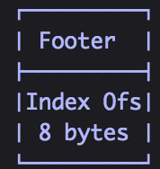

# 存储引擎

## InfluxDB的存储引擎和TSM

新的InfluxDB的存储引擎看起来和LSM树很像。它具有wal和一组只读数据文件，它们在概念上与LSM树中的SSTables类似。 TSM文件包含排序，压缩的series数据。

InfluxDB将为每个时间段创建一个分片。例如，如果您有一个持续时间无限制的存储策略，则会为每7天的时间段创建一个分片。 这些每一个分片都映射到底层存储引擎数据库。 每一个这些数据库都有自己的WAL和TSM文件。 

下面我们来深入存储引擎的这些部分。

### 存储引擎
存储引擎将多个组件结合在一起，并提供用于存储和查询series数据的外部接口。 它由许多组件组成，每个组件都起着特定的作用：
 
 * In-Memory Index —— 内存中的索引是分片上的共享索引，可以快速访问measurement，tag和series。 引擎使用该索引，但不是特指存储引擎本身。
* WAL —— WAL是一种写优化的存储格式，允许写入持久化，但不容易查询。 对WAL的写入就是append到固定大小的段中。
* Cache —— Cache是存储在WAL中的数据的内存中的表示。 它在运行时可以被查询，并与TSM文件中存储的数据进行合并。
* TSM Files —— TSM Files中保存着柱状格式的压缩过的series数据。
* FileStore —— FileStore可以访问磁盘上的所有TSM文件。 它可以确保在现有的TSM文件被替换时以及删除不再使用的TSM文件时，创建TSM文件是原子性的。
* Compactor —— Compactor负责将不够优化的Cache和TSM数据转换为读取更为优化的格式。 它通过压缩series，去除已经删除的数据，优化索引并将较小的文件组合成较大的文件来实现。
* Compaction Planner —— Compaction Planner决定哪个TSM文件已准备好进行压缩，并确保多个并发压缩不会彼此干扰。
* Compression —— Compression由各种编码器和解码器对特定数据类型作处理。一些编码器是静态的，总是以相同的方式编码相同的类型; 还有一些可以根据数据的类型切换其压缩策略。
* Writers/Readers —— 每个文件类型（WAL段，TSM文件，tombstones等）都有相应格式的Writers和Readers。

#### Write Ahead Log(WAL)
WAL被组织成一堆看起来像`_000001.wal`这样的文件。 文件编号单调增，并称为WAL段。 当分段达到10MB的大小时，该段将被关闭并且打开一个新的分段。每个WAL段存储多个压缩过的写入和删除块。

当一个新写入的点被序列化时，使用Snappy进行压缩，并写入WAL文件。 该文件是`fsync'd`，并且在返回成功之前将数据添加到内存中的索引。 这意味着批量的数据点写入可以实现更高的性能。（在大多数情况下，最佳批量大小似乎是每批5,000-10,000点。）

WAL中的每个条目都遵循[TLV标准](https://en.wikipedia.org/wiki/Type-length-value)，以一个单字节表示条目类型（写入或删除），然后压缩块长度的4字节`uint32`，最后是压缩块。

#### Cache
缓存是对存储在WAL中的所有数据点的内存拷贝。这些点由这些key组成，他们是measurement，tag set和唯一field组成。每个field都按照自己的有序时间范围保存。缓存数据在内存中不被压缩。

对存储引擎的查询将会把Cache中的数据与TSM文件中的数据进行合并。在查询运行时间内，对数据副本的查询都是从缓存中获取的。这样在查询进行时写入的数据不会被查询出来。

发送到缓存的删除指令，将清除给定键或给定键的特定时间范围的数据。

缓存提供了一些控制器用于快照。两个最重要的控制器是内存限制。 有一个下限，`cache-snapshot-memory-size`，超出时会触发快照到TSM文件，并删除相应的WAL段。 还有一个上限，`cache-max-memory-size`，当超出时会导致Cache拒绝新的写入。 这些配置有助于防止内存不足的情况，并让客户端写数据比实例可承受的更快。

内存阈值的检查发生在每次写入时。

还有快照控制器是基于时间的。`cache-snapshot-write-cold-duration`，如果在指定的时间间隔内没有收到写入，则强制缓存到TSM文件的快照。

通过重新读取磁盘上的WAL文件，可以重新创建内存中缓存。

#### TSM Files
TSM files是内存映射的只读文件的集合。 这些文件的结构看起来与LevelDB中的SSTable或其他LSM Tree变体非常相似。

一个TSMfile由四部分组成：header，blocks，index和footer:

Header是识别文件类型和版本号的一个魔法数字:

blocks是一组CRC32校验和数据对的序列。  
block数据对文件是不透明的。   
CRC32用于块级错误检测。  
block的长度存储在索引中。

blocks之后是文件中blocks的索引。索引由先按key顺序，如果key相同则按时间顺序排列的索引条目序列组成。key包括measurement名称，tag set和一个field。如果一个点有多个field则在TSM文件中创建多个索引条目。每个索引条目以密钥长度和密钥开始，后跟block类型（float，int，bool，string）以及该密钥后面的索引block条目数的计数。 然后是每个索引block条目，其由block的最小和最大时间组成，之后是block所在的文件的偏移量以及block的大小。 包含该key的TSM文件中每个block都有一个索引block条目。

索引结构可以提供对所有block的有效访问，以及能够确定访问给定key相关联数据需要多大代价。给定一个key和时间戳，我们可以确定文件是否包含该时间戳的block。我们还可以确定该block所在的位置，以及取出该block必须读取多少数据。了解了block的大小，我们可以有效地提供IO语句。 

最后一部分是footer，它存储了索引开头的offset。

#### Compression
每个block都被压缩，以便减少存储空间和查询时磁盘IO。block包含时间戳和给定seris和field的值。每个block都有一个字节的header，之后跟着压缩过的时间戳，然后是压缩后的值。

时间戳和值都会被压缩，并使用依赖于数据类型及其形状的编码分开存储。独立存储允许时间戳编码用于所有时间戳，同时允许不同字段类型的不同编码。例如，一些点可能能够使用游程长度编码，而其他点可能不能。

每个值类型还包含一个1byte的header，表示剩余字节的压缩类型。 四个高位存储压缩类型，如果需要，四个低位由编码器使用。

#### Timestamps
时间戳编码是自适应的，并且基于被编码的时间戳的结构。它使用delta编码，缩放和使用simple8b游程编码压缩的组合，当然如果需要，可以回退到无压缩。

时间戳分辨率是可变的，可以像纳秒一样粒度，最多需要8个字节来存储未压缩的时间戳。在编码期间，这些值首先进行delta编码。第一个值是起始时间戳，后续值是与先前值的差值。这通常将值转换成更小的整数，更容易压缩。许多时间戳也是单调增加，并且在每10秒的时间的均匀边界上落下。当时间戳具有这种结构时，它们由也是10的因子的最大公约数来缩放。这具有将非常大的整数增量转换成更小的压缩更好的效果。

使用这些调整值，如果所有delta都相同，则使用游程编码来存储时间范围。如果游程长度编码是不可能的，并且纳秒分辨率的所有值都小于（1 << 60）-1（[〜36.5年](https://www.wolframalpha.com/input/?i=\(1+%3C%3C+60)+ - + 1 +纳秒+至+年）），则使用[simple8b编码](https://github.com/jwilder/encoding/tree/master/simple8b)对时间戳进行编码。 Simple8b编码是一个64位字对齐的整数编码，将多个整数打包成一个64位字。如果任何值超过最大值，则使用每个块的8个字节对未压缩的三进制进行存储。未来的编码可能使用修补方案，如“Patched Frame-Of-Reference (PFOR)”来更有效地处理异常值。

